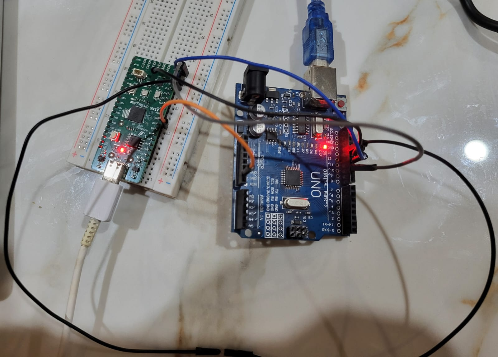
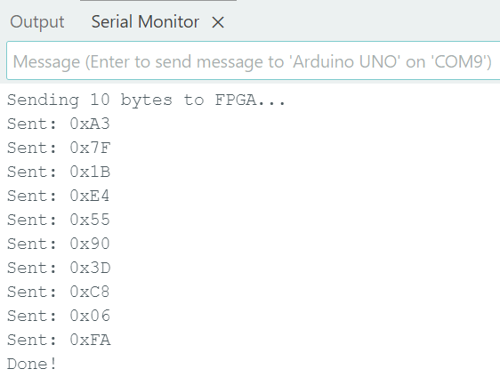
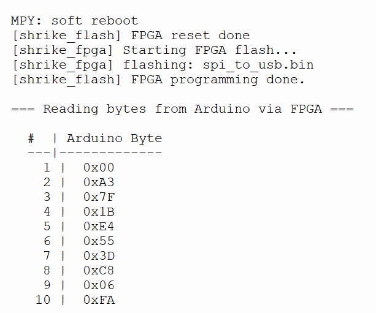

# spi_to_usb

**Difficulty:** Intermediate
**Uses MCU:** Yes
**External Hardware:** Arduino Uno (external SPI master)

## Overview

This example turns the Shrike board into an **SPI-to-USB bridge**. The Arduino Uno acts as an external SPI master, sending bytes to the FPGA. The FPGA captures these bytes as an SPI target and forwards them over a second SPI link to the RP2040, which then sends them to the PC over USB serial.

You will learn how to interface the FPGA with an external SPI master and pass data through the internal RP2040 link to a host PC.

## Compatibility

| Board                | Firmware                | Status     |
| -------------------- | ----------------------- | ---------- |
| Shrike-Lite (RP2040) | `firmware/micropython/` | ✅ Tested  |
| Shrike (RP2350)      | `firmware/micropython/` | ⚪ Untested |
| Shrike-fi (ESP32-S3) | `firmware/micropython/` | ⚪ Untested |

> FPGA bitstream is the same across all boards.

## Hardware Setup

An Arduino Uno is used as the external SPI master. The Uno is a 5 V device, so the signals driving the FPGA (`ext_sck`, `ext_mosi`, `ext_ss_n`) must be level-shifted from 5 V down to 3.3 V using resistor dividers.

### FPGA Connections (link to RP2040 — FPGA is slave)

| FPGA GPIO Pin | Signal Name   | Direction | Description              |
| ------------- | ------------- | --------- | ------------------------ |
| 3             | `spi_sck`     | Input     | SPI clock                |
| 4             | `spi_ss_n`    | Input     | Chip select (active low) |
| 5             | `spi_mosi`    | Input     | MOSI (receive)           |
| 6             | `spi_miso`    | Output    | MISO (transmit)          |
| 16            | `led`         | Output    | LED (shows last byte)    |

### FPGA Connections (link to Arduino — FPGA is slave)

| FPGA GPIO Pin | Signal Name   | Direction | Description                  |
| ------------- | ------------- | --------- | ---------------------------- |
| 0             | `ext_sck`     | Input     | SPI clock from master (via divider) |
| 1             | `ext_mosi`    | Input     | Master output (via divider)  |
| 7             | `ext_ss_n`    | Input     | Chip select (via divider)    |
| 8             | `ext_miso`    | Output    | Master input (no divider needed) |

### RP2040 Connections

| RP2040 Pin | Signal Name | Direction | Description   |
| ---------- | ----------- | --------- | ------------- |
| 2          | SCK         | Output    | SPI clock     |
| 1          | CS          | Output    | Chip select   |
| 3          | MOSI        | Output    | Master output |
| 0          | MISO        | Input     | Master input  |

### Arduino Uno Connections (external master)

| Arduino Pin | Signal Name | Direction | Connects to FPGA          |
| ----------- | ----------- | --------- | ------------------------- |
| D13         | SCK         | Output    | `ext_sck` (GPIO 0)        |
| D11         | MOSI        | Output    | `ext_mosi` (GPIO 1)       |
| D12         | MISO        | Input     | `ext_miso` (GPIO 8)       |
| D10         | SS          | Output    | `ext_ss_n` (GPIO 7)       |
| GND         | GND         | —         | Common ground             |

### Level Shifting

The Arduino Uno drives SCK, MOSI, and SS at 5 V. Use a resistor divider (e.g. 1.8 kΩ series / 3.3 kΩ to ground) on each of these lines before they reach the 3.3 V FPGA inputs. The FPGA output (`ext_miso`) at 3.3 V is read fine by the Uno.

## Quick Start (Pre-Built Bitstream)

1. Connect the Shrike board via USB.
2. Open `firmware/arduino-ide/spi_to_usb.ino` in the Arduino IDE, upload it to the Uno, and open its Serial Monitor at 115200 baud.
3. Open `firmware/micropython/spi_to_usb.py` in Thonny and run it on the RP2040. This will automatically flash `bitstream/spi_to_usb.bin`.
4. Expected result: the bytes sent from the Arduino appear on the Thonny console, confirming the data path: Arduino → FPGA → RP2040 → PC.

## Build From Source

### FPGA (Verilog)

1. Open the project in Go Configure Software Hub.
2. Ensure `top_arduino_master.v` and `spi_target.v` from `ffpga/src/` are included.
3. Configure the I/O mapping as listed in the tables above.
4. Generate the bitstream.

## How It Works

The data path is: **Arduino (SPI master) → FPGA → RP2040 → PC USB**. 

1. **`top_arduino_master.v`**: Contains two `spi_target` instances. One receives bytes from the Arduino, the other serves the last received byte to the RP2040.
2. **`spi_target.v`**: A robust SPI slave implementation that synchronizes asynchronous SPI signals (SCK, SS) into the system clock domain.

## Expected Output

* The Arduino Serial Monitor will show the sent bytes.
* The Thonny console connected to the RP2040 will show the received bytes matching the sent bytes.

